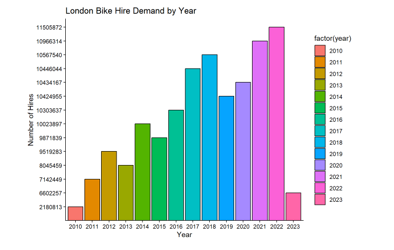
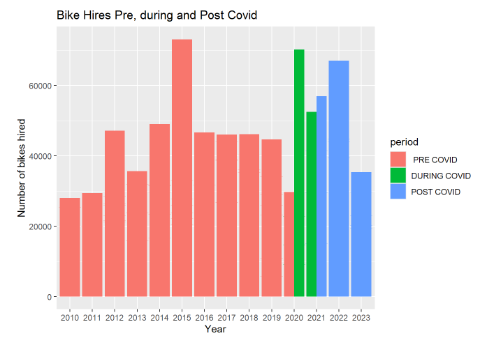
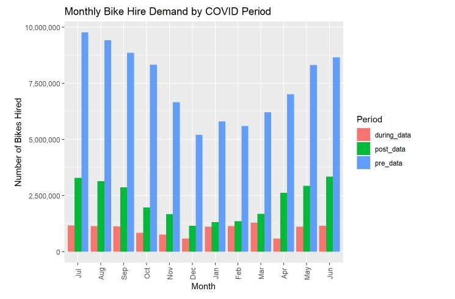
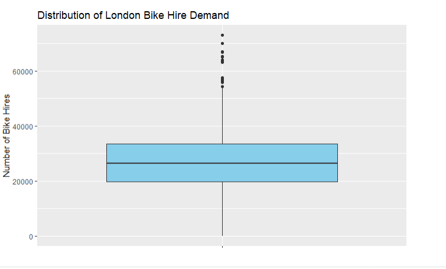

# London-Bike-Hire-Demand-Analysis-

# London Bike Hire Demand Analysis During COVID-19

## Overview

This project analyses London bike hire demand between 2010 and 2023, with a focus on how COVID-19 restrictions and behavioural changes affected daily bike hire patterns.

The analysis explores bike hire trends before, during, and after COVID-19, using statistical analysis, visualisation, regression modelling, and ANOVA to understand the relationship between policy restrictions and transport demand.

## Business Problem

Transport demand changed significantly during COVID-19 due to work-from-home rules, business closures, stay-at-home policies, and social restrictions.

This project investigates how these policy changes influenced bike hire behaviour in London and identifies which time-based or policy-related factors were most relevant to demand changes.

## Tools Used

* R
* tidyverse
* ggplot2
* dplyr
* lubridate
* forecast
* tsibble
* Linear regression
* ANOVA

## Methodology

* Imported and cleaned London bike hire data
* Checked missing values, duplicates, and outliers
* Aggregated bike hires by year
* Split the data into pre-COVID, during-COVID, and post-COVID periods
* Visualised demand trends across different periods
* Analysed COVID policy indicators including work from home, rule of six, curfew, and Eat Out to Help Out
* Built regression models to assess relationships between policy variables and bike hires
* Used ANOVA to compare model performance across year, month, and day-level interactions

## Key Insights

* Bike hire demand showed visible changes across pre-COVID, during-COVID, and post-COVID periods.
* Time-based factors such as month, year, and day improved model performance when included with policy variables.
* Work-from-home and COVID restriction variables alone did not fully explain bike hire demand.
* ANOVA results suggested that adding time-based interaction effects improved the ability to explain bike hire variation.

## ## Visualisations

### Yearly Bike Hire Trends

Shows the overall change in London bike hire demand across different years, highlighting behavioural shifts during and after COVID-19 restrictions.

---

### COVID Period Demand Comparison

Compares bike hire demand before, during and after COVID-19 to identify changes in mobility behaviour and transport usage patterns.

---

### Monthly Demand Patterns

Analyses month-wise variation in bike hire demand across different COVID periods to understand seasonal and behavioural trends.

---

### COVID Policy Timeline

Visualises the implementation timeline of key COVID-related policies and restrictions used in the analysis.

---

### Bike Hire Distribution

Boxplot visualisation used to review the distribution of bike hires and identify potential outliers within the dataset.

## Project Value

This project demonstrates public transport analytics, statistical modelling, time-based trend analysis, and policy impact evaluation using R. It shows how data can be used to understand behavioural change and support transport planning decisions.
